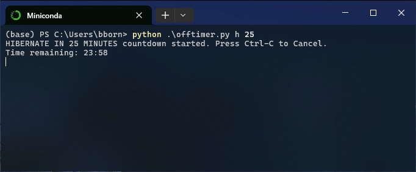

# offtimer.py

A Python command-line utility for Windows that lets you countdown to a shut down, restart, hibernate or log off.

### Usage

In the command line (inside the file's directory), type:\
`python ./offtimer.py <behaviour> <minutes>`

Behaviour argument must be specified (there is no default):
| Argument | Action to be taken |
| :---: | --- |
| `s`| Shut down |
| `r` | Restart |
| `h` | Hibernate |
| `l` | Log off |

If no time argument is provided, the action will be taken immediately.\
Press <kbd>Ctrl</kbd>+<kbd>C</kbd> to abort before the timer runs down.

### Example

To hibernate in 25 minutes, type `python ./offtimer.py h 25`.
The utility will show a countdown of the time remaining in 5 second decrements, then execute the behaviour specified.

